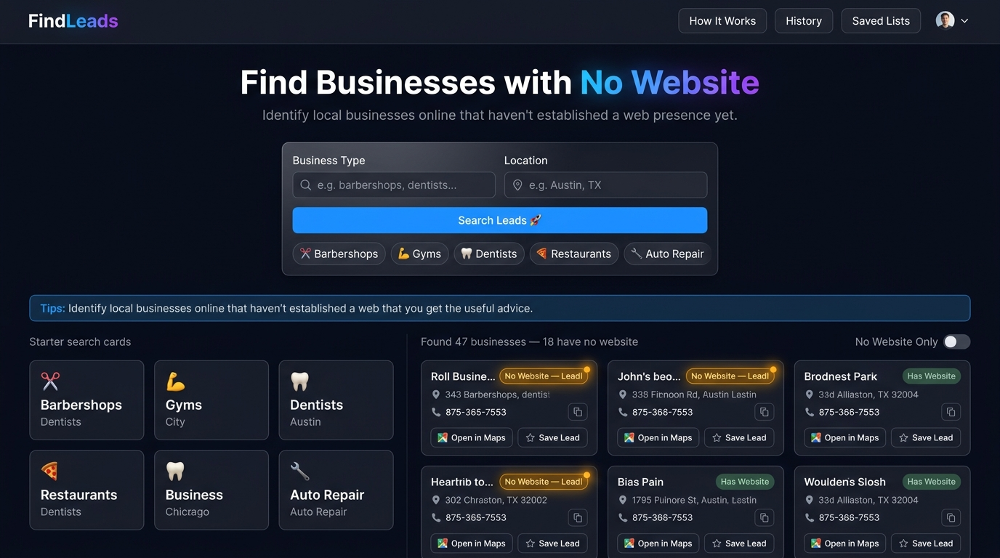

# FindLeads

> **Find local businesses with no website — 100% free, no API keys, no sign-up.**



**[🚀 Live Demo →](https://your-username.github.io/FindLeads)**

FindLeads is a fully open-source, browser-based lead generation tool for freelancers, web designers, and digital marketing agencies. Type in a business category and a city, and within seconds you'll see a list of local businesses pulled from OpenStreetMap — each one showing whether or not they have a website. The ones without a website are your warm leads.

---

## ✨ Features

- 🔍 **Search 100+ business categories** across any city in the world
- 🌐 **Website detection** — instantly flags businesses with no website
- 📍 **Google Maps deeplink** — open any listing in one click
- 📞 **Phone numbers** — displayed directly on the card with one-click copy
- ⭐ **Saved Lists** — save leads to named lists, persisted in your browser
- 📤 **CSV Export** — download any saved list as a spreadsheet, no server needed
- 🕐 **Search History** — your last 10 searches are remembered automatically
- 📱 **Fully responsive** — works great on mobile and desktop
- ⚡ **No install** — open `index.html` and it works. That's it.

---

## 🚀 How to Use

1. **Open the app** at your GitHub Pages URL (or open `index.html` locally)
2. **Type a business type** — e.g. *barbershops*, *dentists*, *auto repair*
3. **Type a city** — e.g. *Austin, TX* or *London, UK*
4. **Click "Search Leads"** — results appear within seconds
5. **Look for the amber badge** — any business showing **"No Website — Lead!"** is a warm prospect
6. **Click "Open in Maps"** to verify the listing and find the phone number
7. **Click "Save Lead"** to add it to a named list you create
8. **Export as CSV** from the Saved Lists panel to import into your CRM

---

## 🗂️ Data Sources

### [OpenStreetMap](https://www.openstreetmap.org/) via [Overpass API](https://overpass-api.de/)
All business data comes from OpenStreetMap — the world's largest open geographic database. The Overpass API provides free, read-only programmatic access with no authentication required.

> Business data © [OpenStreetMap contributors](https://www.openstreetmap.org/copyright), available under the [Open Database License (ODbL)](https://opendatacommons.org/licenses/odbl/).

### [Nominatim](https://nominatim.openstreetmap.org/)
City names are converted to geographic coordinates using Nominatim — OpenStreetMap's free geocoding service. No API key required.

### [Google Maps Search URLs](https://www.google.com/maps)
The "Open in Maps" button uses a standard Google Maps search URL that requires no API key — just a URL format that anyone can open in a browser.

---

## 💻 Local Development

No installation required. Seriously.

```bash
git clone https://github.com/your-username/FindLeads.git
cd FindLeads
# Open index.html in your browser
```

That's it. The app uses only browser-native APIs (`fetch`, `localStorage`, `Blob`, `Clipboard`). There is no build step, no `npm install`, no Node.js required.

> **Note:** Some browsers block `type="module"` scripts when loading from `file://`. If the app doesn't load locally, use a simple dev server:
> ```bash
> npx serve .
> # or
> python -m http.server 8080
> ```

---

## 🌍 Deploying to GitHub Pages

1. Fork this repository
2. Go to **Settings → Pages**
3. Set source to **Deploy from branch**, select `main`, folder `/`
4. Click Save — your site is live at `https://your-username.github.io/FindLeads`

Every push to `main` updates the live site automatically. No CI/CD needed.

---

## ⚠️ Known Limitations

- **OSM coverage varies by region.** In well-mapped cities (NYC, London, Berlin), coverage is excellent. In rural or less-mapped areas, some businesses may be missing from OpenStreetMap.
- **Phone number coverage is ~30–50%.** Not every business in OSM has a phone tag. When unavailable, the Google Maps link is your fallback.
- **"No website" is based on OSM tags only.** A business might have a Facebook page or a Yelp listing without a standalone website — in practice, these are still excellent prospects to pitch.
- **Overpass API may occasionally be slow** during peak hours. FindLeads handles this with a timeout message and a retry button.
- **CORS on `file://`** — if loading locally without a dev server, use `npx serve .` or similar.

---

## 🤝 Contributing

Contributions are welcome! The easiest way to contribute is to expand the business category mapping table in `app.js`. See [CONTRIBUTING.md](CONTRIBUTING.md) for a step-by-step guide.

Other ideas:
- Add more language/locale support for city name inputs
- Improve address parsing for international OSM data
- Add more sort/filter options (e.g. filter by phone number availability)
- Improve mobile UX

---

## 📄 License

The **code** in this repository is released under the [MIT License](LICENSE).

The **data** returned by the app is from OpenStreetMap, released under the [Open Database License (ODbL)](https://opendatacommons.org/licenses/odbl/). You must comply with ODbL terms when using, sharing, or building products on top of this data.

---

## 🙏 Acknowledgements

- [OpenStreetMap](https://www.openstreetmap.org/) contributors — the millions of volunteers who map the world
- [Overpass API](https://overpass-api.de/) — free, open access to OSM data
- [Nominatim](https://nominatim.openstreetmap.org/) — free geocoding service
- [Inter typeface](https://rsms.me/inter/) — by Rasmus Andersson, via Google Fonts

---

*Built with ❤️ for the freelance and web design community.*
